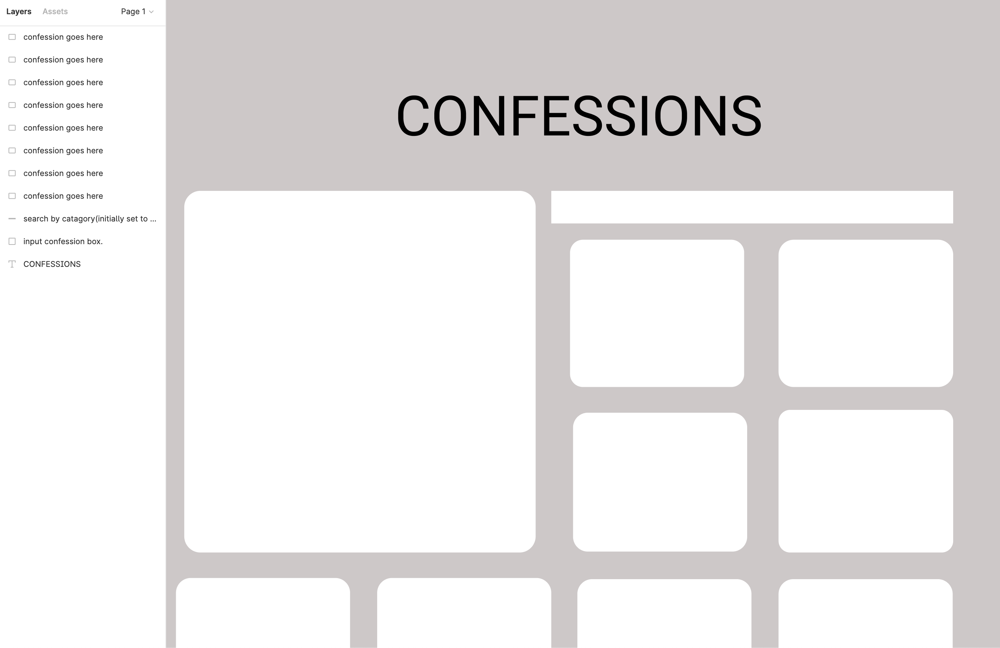
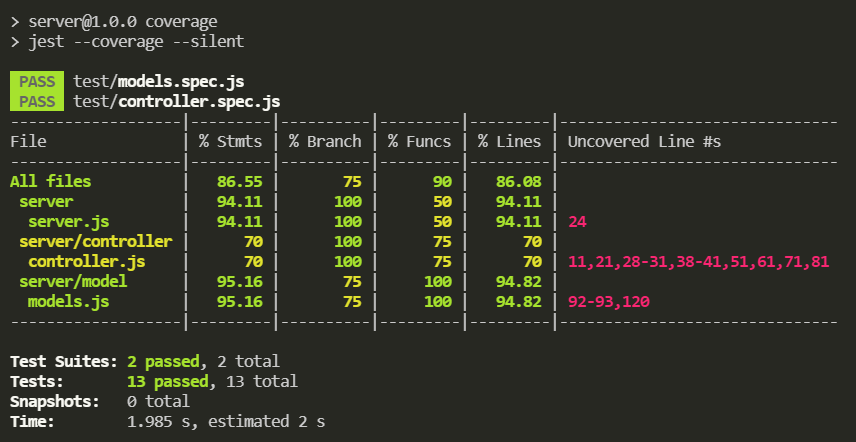
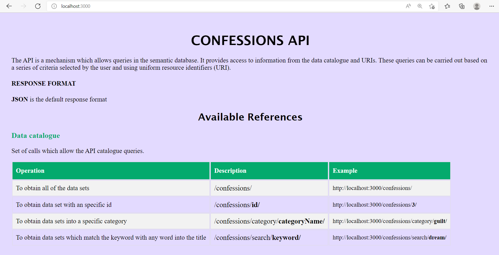
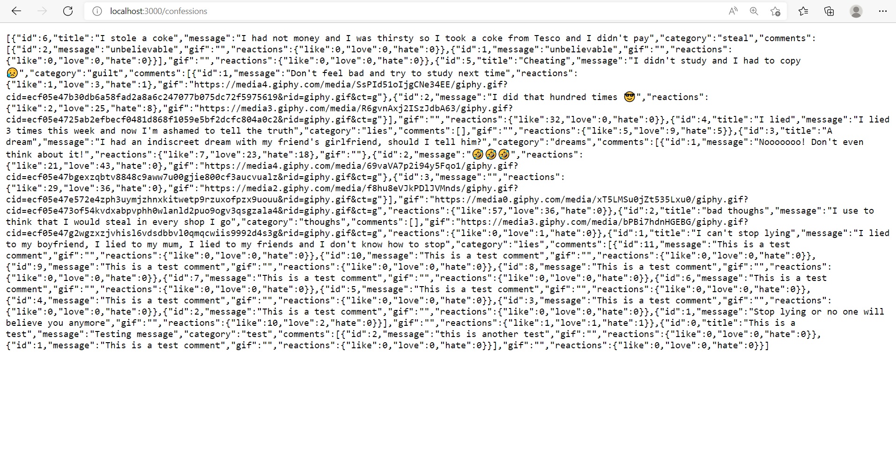
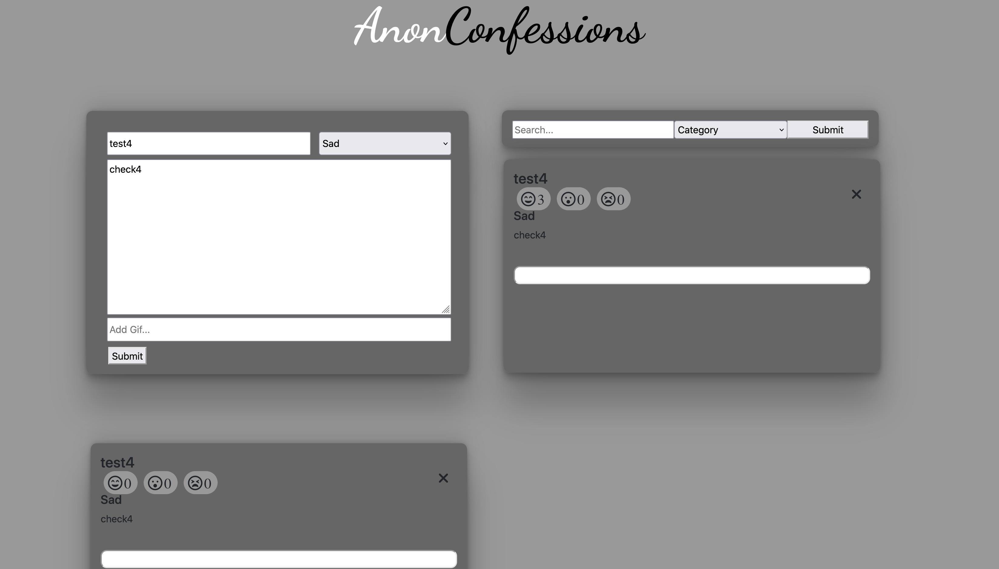
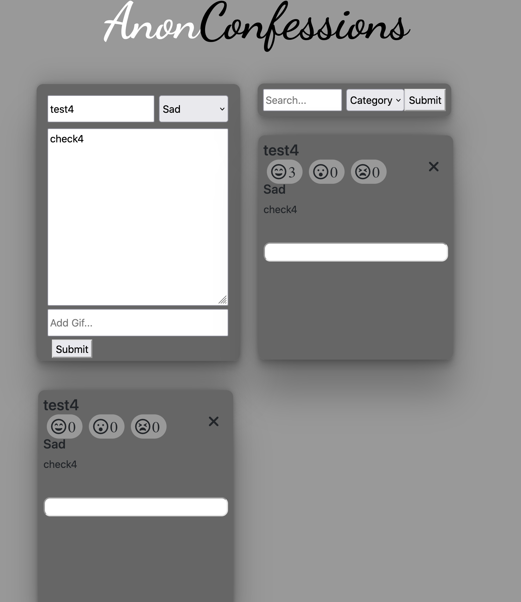
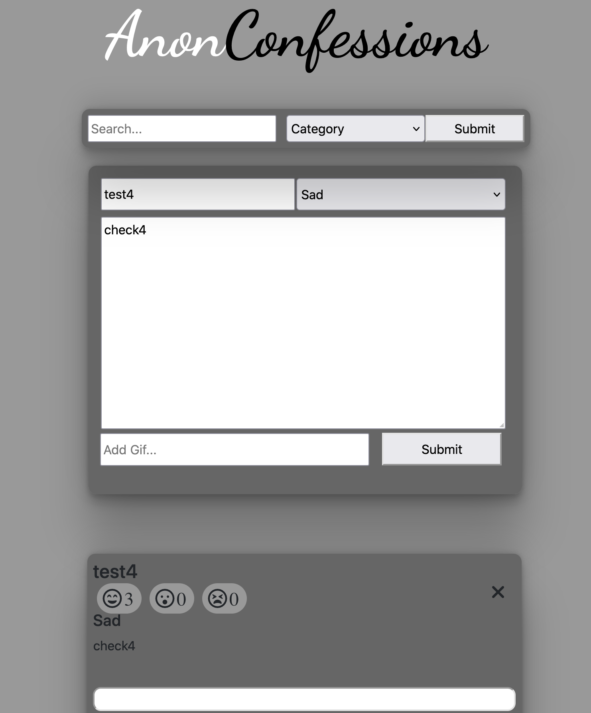

# LAP 1 PROJECT: ANONYMOUS CONFESSIONS

BY [Arvin Jhurry](https://github.com/ArvinJhurry), [Anh Nguyen](https://github.com/hihaianh), [Harry Moore](https://github.com/umalik00), [Isabel Repetto](https://github.com/neifors)

## Links:

- [Server](https://anonconfess.herokuapp.com/)
- [Client](https://elastic-nightingale-eb973a.netlify.app/)
- [Client repo](https://github.com/neifors/anonymous-confessions-project)

## A place where to feel free to confess anything anonymously

We were asked to create a website where users should be able to post journal entries anonymously. We all decided during our first meeting the website would be about anonymous confessions. Somewhere to be free to confess anything being able to share a gif if that helps you to express your confession better. Users can react with emojis to others confessions and also leave a comment. 

## PROCESS
- Meeting to plan how to approach the work and how the distribution of task was going to be.

- Server:
	- Creating a Data Structure prototype to start working with. 

   
	- Using that prototype to create a model and all the methods we decided the object should have. 
	- Writting a data sample to work with. A JSON file where all our data will be saved.
	- Installing **Express.js** which is a modular web framework for Node.js used for easier creation of web applications and services.
	- Building endpoints and functionality. All the urls and behaviors the client needs to communicate with the server (GET, POST and DELETE methods).
	- Creating really simple clients to play around with the server and checking the post and delete methods mostly.
	- Testing by using **jest** and **supertest** *(A library for testing node.js HTTP servers)*
	- Deployed on c

- Client:
	- Initially started with a design concept created on figma

	
	- Created a skeleton html and css, inside the html was an example template of all required components to be created so Arvin could work on creating the elements to display.
	- Worked Desktop first
	- Got the template working for desktop to GET the desired information and display. (see GET request and funtionality.png)
	- Worked on the other required methods discussed as whole group.
		- added reactions
		- added delete button
		- added commenting in script.js. 
	- Worked on other views for pads and mobile once the functionality was working.
	- Deployed on [Netlify](https://www.netlify.com/)
	
## HOW TO USE IT LOCALLY
 - Clone this repository
 - Server
 	- Using git bash or your terminal go into the server folder
		- `npm intall` --will install all the dependencies you need to execute this server
		- `npm run dev` --using **nodemon** will run the server into localhost:3000
	- Dependencies are
	    - cors
	    - express
	    - jest / supertest / coverage
	    - nodemon
	    - supertest
	    - watchify

 - Client
	- Run `index.html` 
		- If you are using VS Code, just need to install the Live Server extension, then go into the html file, right click on it and select "Open with Live Server"

## TESTING

Test are done over the server in separate files. One is working over models.js and the other one over index.js, server.js and controller.js.

## WINS AND CHALLENGES
### WINS
 - Successfully managed to produce a site which met all of the basic requirements.
 - Server successfully deployed on Heroku
 - Achieved over 70% test coverage for server.
 - Managed to return comments, update posts and include as well as update reaction bar

### CHALLENGES
 - Due to fetch being async and creating N confession post templates it was dificult to access the templates to add event listeners to such things as reactions, close button, and comment bar.
 - Challenge with bootstrap overiding certain aspects of our already created css
 - Conflicts at the end of the proccess to merge all the projects divisions into main branch.

# HOW IS FINALLY LOOKING

## Server

## Client

